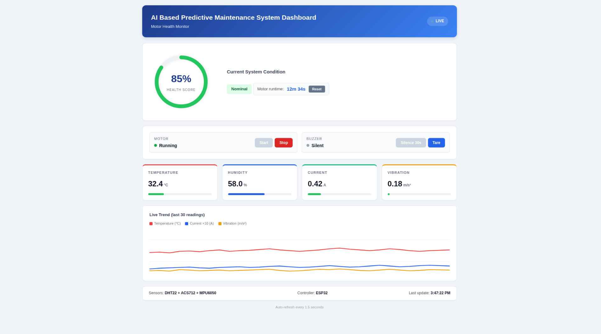

# AI-Based Predictive Maintenance System

AI-Based Predictive Maintenance System for Motor Health Monitoring.

## 📌 Overview
This project presents a real-time, IoT-enabled predictive maintenance system designed to monitor and analyze the operational health of an electric motor using multiple sensors and intelligent scoring techniques.

Leveraging the capabilities of the ESP32 microcontroller, the system continuously collects and processes environmental and operational data—including temperature, humidity, current consumption, and vibration—to evaluate motor performance and detect potential faults before failure occurs.

---

## 🚀 Key Features

### 📡 Real-Time Monitoring
Continuously captures and displays live motor parameters using an embedded web server on ESP32.

### 🧠 Intelligent Health Scoring
Computes a dynamic Motor Health Score (0–100) using weighted analysis of temperature, current, and vibration data.

### 🔗 Multi-Sensor Integration
Combines data from DHT22, ACS712, and MPU6050 for comprehensive system monitoring.

### ⚠️ Predictive Fault Detection
Identifies abnormal conditions early and triggers alerts to prevent system failure.

### 🖥️ Interactive Dashboard
User-friendly interface for real-time monitoring, motor control, and sensor calibration.

### 📊 Live Data Visualization
Displays dynamic trends for better analysis and decision-making.

### 🔔 Smart Alert System
Buzzer and LED indicators with intelligent mute and reset functionality.

### ⏱️ Runtime Monitoring
Tracks motor usage duration for maintenance planning.

### ⚡ Edge Computing Enabled
Performs all computations locally on ESP32 for faster response and reliability.

### 🔧 Scalable Architecture
Easily extendable with additional sensors, cloud integration, or AI models.

---
## 🖼️ Project Preview

### 🖥️ Dashboard UI

---

## 🔌 Hardware Setup

### 🛠️ Circuit Diagram / Connections

---

## 🔗 Connections Overview

- ESP32 connected to DHT22 for temperature & humidity sensing  
- ACS712 used for current measurement  
- MPU6050 connected via I2C for vibration detection  
- L298N motor driver used to control DC motor  
- Buzzer and LEDs used for alert indication  

---

## 🏗️ System Architecture

Sensors → ESP32 → Data Processing → Health Score Calculation → Web Dashboard → Alerts

---

## 🧩 Technologies Used

**Hardware:**
- ESP32  
- DHT22  
- ACS712  
- MPU6050  
- 300 RPM DC 12V Gear Motor  
- Buzzer  
- LED  
- L298N Motor Driver Module  
- 12V Adapter  

**Software:**
- Arduino IDE  

**Networking:**
- Wi-Fi + HTTP Web Server  

**Frontend:**
- HTML, CSS, JavaScript (embedded dashboard)

---

## 🎯 Applications

- Industrial motor monitoring  
- Predictive maintenance systems  
- Smart factories (Industry 4.0)  
- Remote equipment diagnostics  

